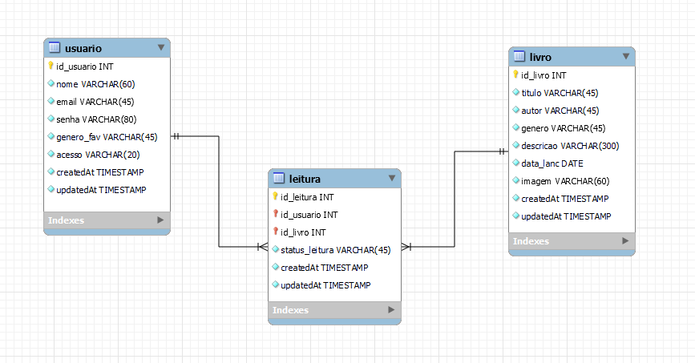

## Desenvolvendo um CRUD com Node.js, Express, Sequelize e EJS, Salvando os dados no MySQL(MariaDB) com ORM

## Descrição

Este projeto é um sistema de gerenciamento de usuários e livros, implementado utilizando **Node.js**, **Express**, **Sequelize** (para banco de dados MySQL), e **EJS** para renderização de views. Ele permite a criação, edição, exclusão e visualização de usuários e livros, além de uma relação N:N entre eles por meio de uma tabela intermediária chamada **Leitura**, que armazena o status de leitura de cada livro por um usuário (não iniciado, em andamento, concluído).

## Funcionalidades

### Usuários:
- **Autenticação**: Usuários podem se registrar e fazer login.
- **Administração**: O administrador pode gerenciar outros usuários, incluindo tornar um usuário administrador ou usuário comum.
- **Perfil de Usuário**: Cada usuário pode editar seu perfil, incluindo nome, e-mail e gênero favorito.
- **Gerenciamento de Livros**: Usuários podem obter livros, editar o status de leitura, e ver a lista de livros disponíveis.

### Livros:
- **CRUD de Livros**: O administrador pode adicionar, editar e excluir livros do sistema.
- **Upload de Imagem**: Cada livro pode ter uma imagem associada, que é carregada e excluída corretamente do servidor.
- **Visualização de Livros**: Todos os usuários podem visualizar a lista de livros cadastrados.

### Relação de Leitura:
- **Relação N:N entre Usuários e Livros**: Cada usuário pode obter livros e marcar o status de leitura (não iniciado, em andamento ou concluído).
- **Atualização de Status de Leitura**: Usuários podem atualizar o status de leitura dos livros obtidos.
- **Visualização Global**: O administrador pode ver o status de leitura de todos os usuários no sistema.

## Tecnologias Utilizadas

- **Node.js**: Ambiente de execução JavaScript no servidor.
- **Express**: Framework web para Node.js.
- **Sequelize**: ORM para interagir com o banco de dados MySQL.
- **MySQL**: Banco de dados relacional.
- **EJS**: Motor de templates para renderização de views.
- **Multer**: Middleware para upload de arquivos.
- **Express-session**: Para manutenção de sessões de usuário (login e autenticação).

## Estrutura de Pastas

```bash
├── controllers/       # Contém os controladores de lógica de negócio (userController.js, livroController.js, leituraController.js)
├── models/            # Modelos do Sequelize (User.js, Livro.js, Leitura.js)
├── routes/            # Definição de rotas da aplicação (userRotas.js, livroRotas.js, leituraRotas.js)
├── views/             # Arquivos EJS para renderização das páginas HTML
├── public/            # Arquivos estáticos (CSS, JS, imagens)
├── uploads/           # Armazena os arquivos de imagem dos livros carregados
├── app.js             # Arquivo principal da aplicação Express
└── package.json       # Arquivo de configuração do Node.js com as dependências do projeto

```
## Instalação

### Pré-requisitos:

- Node.js instalado
- MySQL instalado

## Passos para rodar o projeto:
# 1. Clone o repositório:
```bash
git clone https://github.com/seu-usuario/crud-livros-usuarios.git
```
```bash
# 2. Instale as dependências:
npm install
```
# 3. Crie o banco de dados MySQL e configure a conexão no arquivo config/config.json:

## Modelo Lógico 


```bash
{
  "development": {
    "username": "root",
    "password": "sua-senha",
    "database": "bibioteca",
    "host": "127.0.0.1",
    "dialect": "mysql"
  }
}
```
# 4. Rode as migrações para criar as tabelas no banco de dados:
```bash
npx sequelize-cli db:migrate
```
# 5. Inicie o servidor:
```bash
npm start
```
# 6. Acesse a aplicação em:
```bash
http://localhost:3000\login

```

## Funcionalidades de Rotas

### Usuários

#### Lista todos os usuários (somente admin).
GET /users

#### Cria um novo usuário.
POST /users

#### Exibe detalhes de um usuário.
GET /users/:id

#### Edita as informações do usuário.
POST /users/edit/:id

#### Exclui o usuário.
POST /users/delete/:id

#### Torna um usuário administrador.
POST /users/tornar-admin/:id

#### Torna um administrador um usuário comum.
POST /users/tornar-user/:id

### Livros

#### Lista todos os livros.
GET /livros

#### Adiciona um novo livro.
POST /livros

#### Exibe detalhes de um livro.
GET /livros/:id

#### Edita as informações do livro.
POST /livros/edit/:id

#### Exclui o livro.
POST /livros/delete/:id

### Leitura

#### Admin visualiza o status de leitura de todos os usuários.
GET /leitura

#### Usuário obtém um livro e define o status de leitura.
GET /obter-livro/:id

#### Usuário edita o status de leitura de um livro já obtido.
POST /editar-status/:id

### Contribuições
Contribuições são bem-vindas! Siga os seguintes passos para contribuir:

#### Faça um fork do projeto.
#### Crie uma branch:
```bash
git checkout -b feature/minha-melhoria
```

#### Commit suas alterações:
```bash
git commit -m 'Adicionei uma nova funcionalidade'
```

#### Faça um push para a branch:
```bash
git push origin feature/minha-melhoria
```

### THANKS

